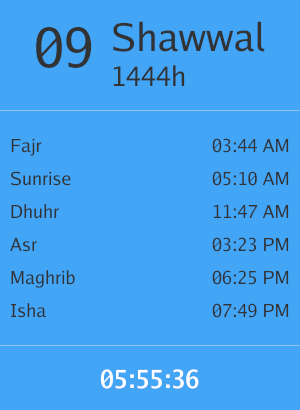

# Athan App

A simple Athan app that displays Islamic prayer times and the current Hijri date in a small desktop window. It's built using the Gio UI framework for Go.



## Installation

### Prerequisites

You'll need Go installed on your system. You can download Go from the [official website](https://golang.org/dl/).

### Clone the Repository

Clone the repository to your local machine:

```shell
git clone https://github.com/Y-AH/athan-app.git
```


### Build the Application

Navigate to the project folder and build the application:

```shell
cd athan-app
go build
```


## Usage

Run the compiled binary:

```shell
./athan-app
```


The Athan App window will appear, displaying the current Hijri date, prayer times, and a countdown to the next prayer.

## Customization

You can customize the app by modifying the source code, such as changing the colors, layout, or adding new features. Refer to the [Gio documentation](https://gioui.org/docs/) for more information on how to use the Gio UI framework.

## License

This project is licensed under the GNU General Public License v3.0. See the [LICENSE](./LICENSE.md) file for details.

## Acknowledgements

This project was created with the assistance of [OpenAI's ChatGPT 4.0](https://www.openai.com/chatgpt). ChatGPT 4.0 was instrumental in converting the UI design from HTML/CSS to Go. We appreciate the invaluable support provided by this advanced language model.

- [Gio](https://gioui.org/) - The Go-based UI framework used for building the app.
- [Go Hijri](https://github.com/hablullah/go-hijri) - A Go library for working with Hijri dates.
- [Adhango](https://github.com/mnadev/adhango) - A Go library for calculating Islamic prayer times.


